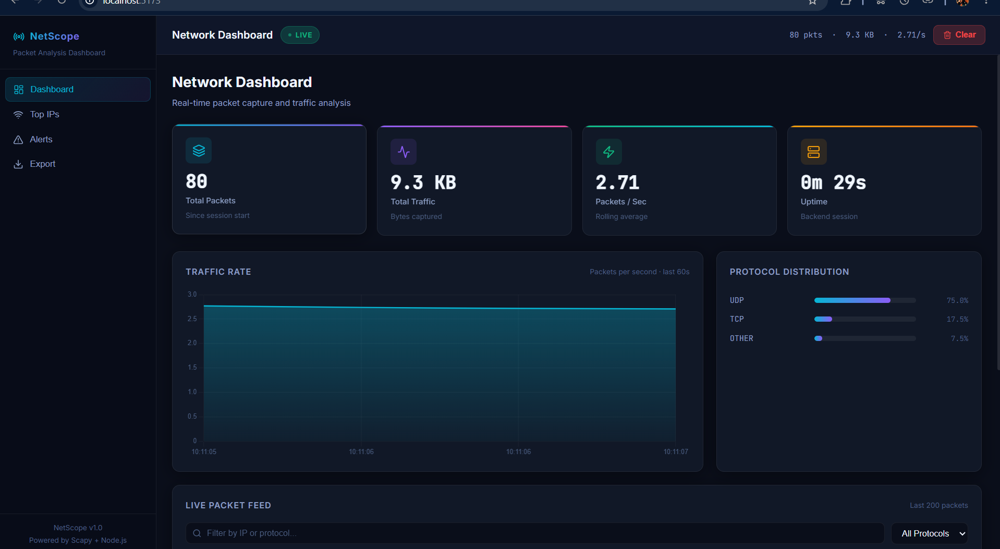
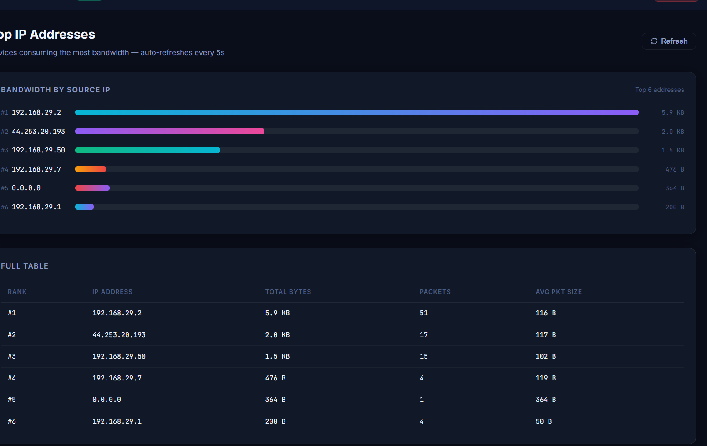
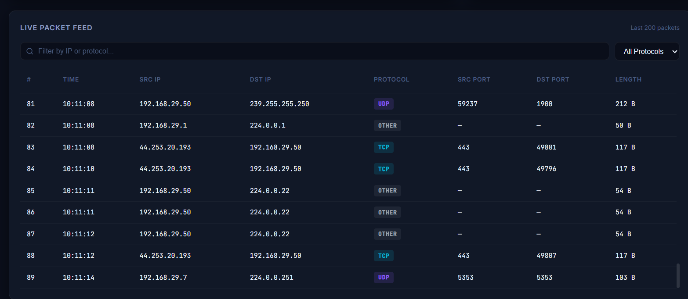
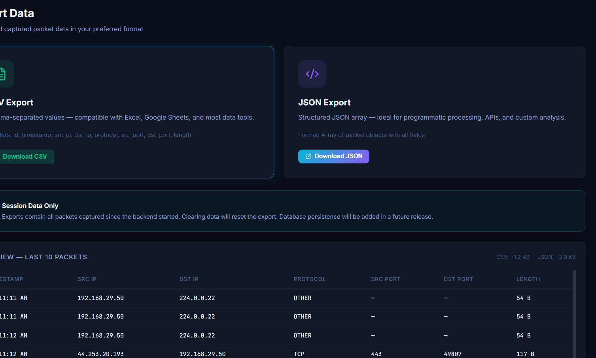

# Web-Based Packet Analyzer

A real-time web-based packet analyzer and network monitoring dashboard built using React, TypeScript, Node.js, and Python.

The project captures network packets, analyzes traffic, and visualizes network activity through interactive graphs and live dashboards.

---

# Features

- Real-time packet capture
- Live network traffic monitoring
- Upload/download speed tracking
- Packet statistics dashboard
- Interactive traffic graphs
- Protocol filtering
- Live packet table
- Cybersecurity-focused traffic analysis

---

# Tech Stack

## Frontend

- React
- TypeScript
- Tailwind CSS
- Chart.js

## Backend

- Node.js
- Express
- Socket.IO
- TypeScript

## Packet Capture Engine

- Python
- Scapy

---

# Architecture

```text
Python Packet Sniffer
        ↓
Node.js Backend
        ↓
Socket.IO
        ↓
React Dashboard
```

---

# Screenshots

## Dashboard



## Traffic Graph



## Live Packet Table



## Exporting



---

# Installation

## Clone Repository

```bash
git clone <your-repo-url>
```

---

## Frontend Setup

```bash
cd frontend
npm install
npm run dev
```

---

## Backend Setup

```bash
cd backend
npm install
npm run dev
```

---

## Python Packet Sniffer Setup

Install dependencies:

```bash
pip install scapy requests
```

For Windows:

- Install Npcap
- Enable WinPcap compatibility mode

---

# Usage

1. Start backend server
2. Start frontend
3. Run packet sniffer
4. Open dashboard in browser

---

# Planned Features

- Suspicious traffic detection
- Port scan detection
- AI anomaly detection
- Packet export
- Multi-device monitoring
- Authentication system

---
